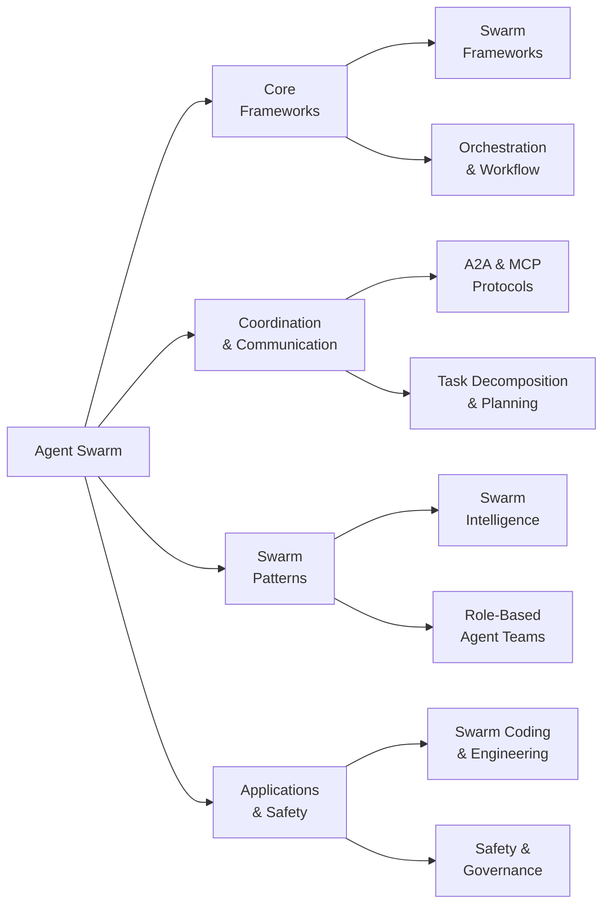

# Awesome Agent Swarm 

> Multi-agent swarm systems, orchestration frameworks, swarm intelligence, agent communication protocols, and collaborative AI.

## Contents

- [Taxonomy](#taxonomy)
- [Swarm Frameworks](#swarm-frameworks)
- [Orchestration and Workflow](#orchestration-and-workflow)
- [Agent Communication and Protocols](#agent-communication-and-protocols)
- [Swarm Intelligence](#swarm-intelligence)
- [Role-Based Agent Teams](#role-based-agent-teams)
- [Task Decomposition and Planning](#task-decomposition-and-planning)
- [Swarm Coding and Engineering](#swarm-coding-and-engineering)
- [Safety and Governance](#safety-and-governance)
- [Key Research Papers](#key-research-papers)
- [Benchmarks and Evaluation](#benchmarks-and-evaluation)
- [Community and Resources](#community-and-resources)

## Taxonomy

## Swarm Frameworks

Core frameworks for building and managing multi-agent swarm systems.

<!-- AUTOGEN:frameworks -->
- [**AutoGen**](https://github.com/microsoft/autogen) - A programming framework for agentic AI. Build multi-agent applications with conversational patterns. by [@microsoft](https://github.com/microsoft) (56,730 stars)
- [**AgentScope**](https://github.com/agentscope-ai/agentscope) - Build and run agents you can see, understand and trust. Production-ready framework with ReAct, memory, planning, and A2A support. by [@agentscope-ai](https://github.com/agentscope-ai) (23,021 stars)
- [**Mastra**](https://github.com/mastra-ai/mastra) - From the team behind Gatsby. A framework for building AI-powered applications and agents with modern TypeScript. by [@mastra-ai](https://github.com/mastra-ai) (22,714 stars)
- [**Swarm (OpenAI)**](https://github.com/openai/swarm) - Educational framework exploring ergonomic, lightweight multi-agent orchestration. Demonstrates handoffs and routines patterns. by [@OpenAI](https://github.com/OpenAI) (21,273 stars)
- [**OpenAI Agents Python**](https://github.com/openai/openai-agents-python) - A lightweight, powerful framework for multi-agent workflows from OpenAI. Features handoffs, guardrails, and tracing. by [@OpenAI](https://github.com/OpenAI) (20,587 stars)
- [**Google ADK**](https://github.com/google/adk-python) - Open-source Python toolkit by Google for building, evaluating, and deploying sophisticated AI agents with multi-agent support. by [@google](https://github.com/google) (18,765 stars)
- [**Spring AI Alibaba**](https://github.com/alibaba/spring-ai-alibaba) - Agentic AI framework for Java developers by Alibaba. Enterprise-grade multi-agent support with Spring ecosystem. by [@alibaba](https://github.com/alibaba) (9,098 stars)
- [**Microsoft Agent Framework**](https://github.com/microsoft/agent-framework) - A framework for building, orchestrating and deploying AI agents with support for Python and .NET. by [@microsoft](https://github.com/microsoft) (8,917 stars)
- [**PraisonAI**](https://github.com/MervinPraison/PraisonAI) - Production-ready Multi AI Agents framework. Low-code solution for multi-agent LLM systems with 100+ tools. by [@MervinPraison](https://github.com/MervinPraison) (6,725 stars)
- [**Swarms**](https://github.com/kyegomez/swarms) - The Enterprise-Grade Production-Ready Multi-Agent Orchestration Framework. Supports sequential, parallel, and hierarchical swarm patterns. by [@kyegomez](https://github.com/kyegomez) (6,196 stars)
- [**Agency Swarm**](https://github.com/VRSEN/agency-swarm) - Reliable Multi-Agent Orchestration Framework for building agent teams with OpenAI Assistants API. by [@VRSEN](https://github.com/VRSEN) (4,144 stars)
<!-- /AUTOGEN:frameworks -->

## Orchestration and Workflow

Orchestration engines, workflow builders, DAG-based task systems, and pipeline frameworks for agent swarms.

<!-- AUTOGEN:orchestration -->
- [**Dify**](https://github.com/langgenius/dify) - Production-ready platform for agentic workflow development. Combines AI workflow, RAG pipeline, agent capabilities, and model management. by [@langgenius](https://github.com/langgenius) (136,275 stars)
- [**DeerFlow**](https://github.com/bytedance/deer-flow) - Open-source long-horizon SuperAgent harness by ByteDance. Researches, codes, and creates with multi-agent collaboration. by [@bytedance](https://github.com/bytedance) (58,312 stars)
- [**DSPy**](https://github.com/stanfordnlp/dspy) - Compiling declarative language model calls into state-of-the-art pipelines. Programming -- not prompting -- foundation models. by [@stanfordnlp](https://github.com/stanfordnlp) (33,467 stars)
- [**LangGraph**](https://github.com/langchain-ai/langgraph) - Build resilient language agents as graphs. Low-level orchestration framework for stateful agents with durable execution. by [@langchain-ai](https://github.com/langchain-ai) (28,493 stars)
- [**Haystack**](https://github.com/deepset-ai/haystack) - Open-source AI orchestration framework for building production-ready LLM applications with modular pipelines and agent workflows. by [@deepset-ai](https://github.com/deepset-ai) (24,723 stars)
- [**DB-GPT**](https://github.com/eosphoros-ai/DB-GPT) - AI Native Data App Development framework with AWEL (Agentic Workflow Expression Language) and Agents. by [@eosphoros-ai](https://github.com/eosphoros-ai) (18,447 stars)
- [**Agent Squad**](https://github.com/awslabs/agent-squad) - Flexible and powerful framework for managing multiple AI agents and handling complex conversations. by [@awslabs](https://github.com/awslabs) (7,554 stars)
<!-- /AUTOGEN:orchestration -->

## Agent Communication and Protocols

Standards and protocols for inter-agent messaging, discovery, and interoperability.

<!-- AUTOGEN:communication -->
- [**Google A2A**](https://github.com/google/A2A) - Google's open Agent-to-Agent protocol. Enables agent discovery, secure collaboration, and long-running tasks while preserving agent opacity. by [@google](https://github.com/google) (23,032 stars)
- [**mcp-use**](https://github.com/mcp-use/mcp-use) - The fullstack MCP framework to develop MCP Apps for ChatGPT/Claude and MCP Servers for AI Agents. by [@mcp-use](https://github.com/mcp-use) (9,681 stars)
- [**Casibase**](https://github.com/casibase/casibase) - AI Cloud OS: Enterprise-level AI knowledge base and MCP/A2A management platform with admin UI. by [@casibase](https://github.com/casibase) (4,496 stars)
- [**Python A2A**](https://github.com/themanojdesai/python-a2a) - A powerful library for implementing Google's Agent-to-Agent (A2A) protocol for seamless inter-agent communication. by [@themanojdesai](https://github.com/themanojdesai) (988 stars)
- [**A2A x402**](https://github.com/google-agentic-commerce/a2a-x402) - The A2A x402 Extension brings cryptocurrency payments to the Agent-to-Agent protocol, enabling agents to monetize their services. by [@google-agentic-commerce](https://github.com/google-agentic-commerce) (486 stars)
- [**Coral Anemoi**](https://github.com/Coral-Protocol/Anemoi) - A Semi-Centralized Multi-agent System based on Agent-to-Agent Communication MCP server. by [@Coral-Protocol](https://github.com/Coral-Protocol) (373 stars)
- [**A2A Go**](https://github.com/a2aproject/a2a-go) - Golang SDK for the A2A Protocol. Type-safe agent-to-agent communication for Go developers. by [@a2aproject](https://github.com/a2aproject) (333 stars)
- [**Mangaba AI**](https://github.com/Mangaba-ai/mangaba_ai) - Minimal framework for creating AI agents with A2A and MCP protocols. by [@Mangaba-ai](https://github.com/Mangaba-ai) (189 stars)
- [**A2A MCP Server**](https://github.com/GongRzhe/A2A-MCP-Server) - Bridges Model Context Protocol with Agent-to-Agent protocol, enabling MCP-compatible assistants to interact with A2A agents. by [@GongRzhe](https://github.com/GongRzhe) (146 stars)
- [**GEP MCP Server**](https://github.com/EvoMap/gep-mcp-server) - MCP Server for Genome Evolution Protocol. Exposes evolution tools to Claude Desktop, Cursor, and any MCP client. by [@EvoMap](https://github.com/EvoMap)
<!-- /AUTOGEN:communication -->

## Swarm Intelligence

Emergent behavior, collective reasoning, and self-organizing multi-agent systems.

<!-- AUTOGEN:intelligence -->
- [**CAMEL**](https://github.com/camel-ai/camel) - The first and the best multi-agent framework. Finding the Scaling Law of Agents. by [@camel-ai](https://github.com/camel-ai) (16,601 stars)
- [**LatentMAS**](https://github.com/Gen-Verse/LatentMAS) - Latent collaboration in multi-agent systems. Agents reason and collaborate in continuous latent space instead of natural language. by [@Gen-Verse](https://github.com/Gen-Verse) (859 stars)
<!-- /AUTOGEN:intelligence -->

## Role-Based Agent Teams

Frameworks that organize agents into specialized roles (PM, architect, developer, QA, etc.) for collaborative task execution.

<!-- AUTOGEN:role-teams -->
- [**MetaGPT**](https://github.com/FoundationAgents/MetaGPT) - The Multi-Agent Framework: First AI Software Company, Towards Natural Language Programming. by [@FoundationAgents](https://github.com/FoundationAgents) (66,673 stars)
- [**CrewAI**](https://github.com/crewAIInc/crewAI) - Framework for orchestrating role-playing, autonomous AI agents. Collaborative intelligence for complex tasks. by [@crewAIInc](https://github.com/crewAIInc) (48,116 stars)
- [**ChatDev**](https://github.com/OpenBMB/ChatDev) - Virtual software company via LLM-powered multi-agent collaboration. Agents play PM, architect, developer, and QA roles. by [@OpenBMB](https://github.com/OpenBMB) (32,589 stars)
- [**HiClaw**](https://github.com/agentscope-ai/HiClaw) - Collaborative Multi-Agent OS with Manager-Workers architecture. Human-in-the-loop task coordination with enterprise-grade security. by [@agentscope-ai](https://github.com/agentscope-ai) (3,904 stars)
<!-- /AUTOGEN:role-teams -->

## Task Decomposition and Planning

Systems for breaking complex goals into subtasks, building execution DAGs, and coordinating parallel agent work.

<!-- AUTOGEN:task-decomposition -->
- [**MindSearch**](https://github.com/InternLM/MindSearch) - An LLM-based Multi-agent Framework of Web Search Engine (like Perplexity.ai Pro and SearchGPT). by [@InternLM](https://github.com/InternLM) (6,830 stars)
- [**Open Multi-Agent**](https://github.com/JackChen-me/open-multi-agent) - TypeScript multi-agent orchestration via single runTeam() call. Auto-decomposes goals into task DAGs and runs agents in parallel. by [@JackChen-me](https://github.com/JackChen-me) (4,942 stars)
- [**AFlow**](https://github.com/geekan/AFlow) - Automating agentic workflow generation. Automatically designs optimal multi-agent workflows for given tasks via Monte Carlo tree search. by [@geekan](https://github.com/geekan) (1,500 stars)
- [**ATLAS MCP Server**](https://github.com/cyanheads/atlas-mcp-server) - Neo4j-powered task management system for LLM Agents with three-tier architecture (Projects, Tasks, Knowledge). by [@cyanheads](https://github.com/cyanheads) (471 stars)
<!-- /AUTOGEN:task-decomposition -->

## Swarm Coding and Engineering

Agent swarms applied to collaborative software development, code review, and engineering workflows.

<!-- AUTOGEN:swarm-coding -->
_No projects yet. [Submit one!](https://github.com/EvoMap/awesome-agent-swarm/issues/new?template=project-submission.yml)_
<!-- /AUTOGEN:swarm-coding -->

## Safety and Governance

Guardrails, policy engines, spend caps, kill switches, and governance frameworks for multi-agent systems.

<!-- AUTOGEN:safety -->
- [**NeMo Guardrails**](https://github.com/NVIDIA/NeMo-Guardrails) - NVIDIA's toolkit for adding programmable guardrails to LLM conversational systems. Policy-based safety controls for agent swarms. by [@NVIDIA](https://github.com/NVIDIA) (5,928 stars)
- [**Vigil**](https://github.com/hexitlabs/vigil) - TypeScript agent guardrail with <2ms latency and zero dependencies. Validates agent actions against 22 security rules. by [@hexitlabs](https://github.com/hexitlabs) (5 stars)
- [**Agent Guardrail**](https://github.com/eren-solutions/agent-guardrail) - Action-level governance for AI agents. Policy engine, spend caps, kill switches, flight recorder, and approval gates. by [@eren-solutions](https://github.com/eren-solutions)
<!-- /AUTOGEN:safety -->

## Key Research Papers

Selected papers that shaped the field of multi-agent swarm systems and collaborative AI.

### Multi-Agent Collaboration

- [Self-Evolving Multi-Agent Collaboration Networks](https://arxiv.org/abs/2410.02849) (ICLR'25) - Multi-agent systems that evolve their collaboration patterns.
- [AFlow: Automating Agentic Workflow Generation](https://arxiv.org/abs/2410.10762) (ICLR'25) - Automated design of multi-agent workflows via Monte Carlo tree search.
- [Automated Design of Agentic Systems (ADAS)](https://arxiv.org/abs/2408.08435) (ICLR'25) - Meta-learning for automatic agent system design.
- [GPTSwarm: Language Agents as Optimizable Graphs](https://arxiv.org/abs/2402.16823) (ICML'24) - Graph-based optimization of agent collaboration.
- [AgentVerse: Facilitating Multi-Agent Collaboration](https://arxiv.org/abs/2308.10848) (ICLR'24) - Emergent behaviors in multi-agent environments.
- [SEMAG: Self-Evolutionary Multi-Agent Code Generation](https://arxiv.org/abs/2603.15707) (arXiv'26) - Self-evolutionary agents that auto-upgrade backbone models.
- [SAGE: Multi-Agent Self-Evolution for LLM Reasoning](https://arxiv.org/abs/2603.15255) (arXiv'26) - Four co-evolving agents from shared LLM backbone.
- [Group-Evolving Agents](https://arxiv.org/abs/2602.04837) (arXiv'26) - Agent groups as evolutionary units with experience sharing. 71.0% on SWE-bench Verified.

### Swarm Intelligence and Emergence

- [Communicative Agents for Software Development](https://arxiv.org/abs/2307.07924) (ACL'24) - ChatDev: virtual software company through multi-agent conversation chains.
- [MetaGPT: Meta Programming for A Multi-Agent Collaborative Framework](https://arxiv.org/abs/2308.00352) (ICLR'24) - SOPs encoded as prompts for multi-agent software development.
- [LatentMAS: Latent Collaboration in Multi-Agent Systems](https://arxiv.org/abs/2506.06637) (arXiv'25) - Agents reason and collaborate in continuous latent space.
- [Scaling Large-Language-Model-based Multi-Agent Collaboration](https://arxiv.org/abs/2406.07155) (arXiv'24) - Scaling laws and topology analysis for multi-agent collaboration.

### Agent Communication Protocols

- [A2A: Agent-to-Agent Protocol](https://google.github.io/A2A/) (Google'25) - Open protocol for agent discovery, collaboration, and task management.
- [Model Context Protocol (MCP)](https://modelcontextprotocol.io/) (Anthropic'24) - Standard for connecting AI models to external tools and data.
- [AutoAgent: Fully-Automated and Zero-Code Framework for LLM Agents](https://arxiv.org/abs/2502.05957) (arXiv'25) - Zero-code agent framework with automatic workflow design.

### Task Decomposition and Planning

- [ReWOO: Decoupling Reasoning from Observations](https://arxiv.org/abs/2305.18323) (ICML'24) - Efficient tool-augmented reasoning by decoupling planning from execution.
- [Tree of Thoughts: Deliberate Problem Solving with LLMs](https://arxiv.org/abs/2305.10601) (NeurIPS'23) - Tree-structured reasoning for complex problem solving.
- [Plan-and-Solve Prompting](https://arxiv.org/abs/2305.04091) (ACL'23) - Divide tasks into subtasks and solve them sequentially.
- [HuggingGPT: Solving AI Tasks with ChatGPT and its Friends](https://arxiv.org/abs/2303.17580) (NeurIPS'23) - Task decomposition across specialized AI models.

### Safety and Governance

- [Constitutional AI: Harmlessness from AI Feedback](https://arxiv.org/abs/2212.08073) (arXiv'22) - Self-supervision approach to AI alignment.
- [OpenGuardrails: An Open-Source Context-Aware AI Guardrails Platform](https://arxiv.org/abs/2510.19169) (arXiv'25) - Context-aware safety detection and model-manipulation prevention.

## Benchmarks and Evaluation

- [SWE-bench](https://github.com/princeton-nlp/SWE-bench) (ICLR'24) - Can agent swarms resolve real-world GitHub issues?
- [AgentBench](https://github.com/THUDM/AgentBench) (ICLR'24) - Multi-dimensional evaluation of LLMs as agents.
- [WebArena](https://github.com/web-arena-x/webarena) (ICLR'24) - Realistic web environment for autonomous agents.
- [OSWorld](https://github.com/xlang-ai/OSWorld) (NeurIPS'24) - Open-ended tasks in real computer environments.
- [GAIA](https://huggingface.co/gaia-benchmark) (ICLR'23) - General AI assistant capabilities benchmark.

## Community and Resources

<!-- AUTOGEN:community -->
- [**Learn Agentic AI**](https://github.com/panaversity/learn-agentic-ai) - Comprehensive curriculum covering DACA Design Pattern, OpenAI Agents SDK, Memory, MCP, A2A, Knowledge Graphs, Dapr, and Kubernetes. by [@panaversity](https://github.com/panaversity) (4,052 stars)
<!-- /AUTOGEN:community -->

## Footnotes

Maintained by [EvoMap](https://evomap.ai). See [contributing guidelines](contributing.md) for how to submit a project or paper.

Also check out [Awesome Agent Evolution](https://github.com/EvoMap/awesome-agent-evolution) for agent self-evolution, memory systems, and autonomous self-improvement.

