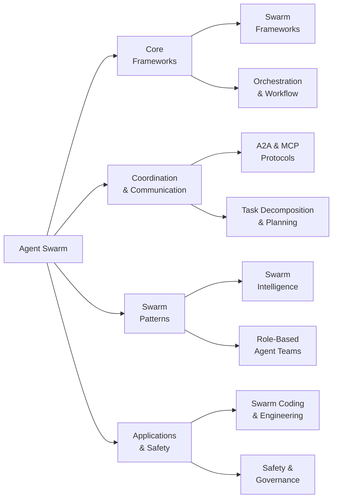

# Awesome Agent Swarm 

> Multi-agent swarm systems, orchestration frameworks, swarm intelligence, agent communication protocols, and collaborative AI.

## Contents

- [Taxonomy](#taxonomy)
- [Swarm Frameworks](#swarm-frameworks)
- [Orchestration and Workflow](#orchestration-and-workflow)
- [Agent Communication and Protocols](#agent-communication-and-protocols)
- [Swarm Intelligence](#swarm-intelligence)
- [Role-Based Agent Teams](#role-based-agent-teams)
- [Task Decomposition and Planning](#task-decomposition-and-planning)
- [Swarm Coding and Engineering](#swarm-coding-and-engineering)
- [Safety and Governance](#safety-and-governance)
- [Key Research Papers](#key-research-papers)
- [Benchmarks and Evaluation](#benchmarks-and-evaluation)
- [Community and Resources](#community-and-resources)

## Taxonomy

## Swarm Frameworks

Core frameworks for building and managing multi-agent swarm systems.

<!-- AUTOGEN:frameworks -->
- [**AutoGen**](https://github.com/microsoft/autogen) - Programming framework for agentic AI by Microsoft. Build multi-agent applications with conversational patterns and group chat. by [@microsoft](https://github.com/microsoft) (56,809 stars)
- [**AgentScope**](https://github.com/agentscope-ai/agentscope) - Production-ready multi-agent framework with ReAct, memory, planning, and A2A support. Build and run agents you can see, understand and trust. by [@agentscope-ai](https://github.com/agentscope-ai) (23,147 stars)
- [**Mastra**](https://github.com/mastra-ai/mastra) - TypeScript framework for building AI-powered multi-agent applications. From the team behind Gatsby. by [@mastra-ai](https://github.com/mastra-ai) (22,784 stars)
- [**Swarm (OpenAI)**](https://github.com/openai/swarm) - Educational framework exploring lightweight multi-agent orchestration. Demonstrates handoffs and routines patterns for agent coordination. by [@OpenAI](https://github.com/OpenAI) (21,279 stars)
- [**OpenAI Agents Python**](https://github.com/openai/openai-agents-python) - Production-ready multi-agent framework from OpenAI. Features agent handoffs, guardrails, and tracing for swarm workflows. by [@OpenAI](https://github.com/OpenAI) (20,643 stars)
- [**Google ADK**](https://github.com/google/adk-python) - Open-source Python toolkit by Google for building, evaluating, and deploying multi-agent systems with orchestration support. by [@google](https://github.com/google) (18,806 stars)
- [**Spring AI Alibaba**](https://github.com/alibaba/spring-ai-alibaba) - Enterprise-grade multi-agent framework for Java developers by Alibaba. Spring ecosystem integration with agent orchestration. by [@alibaba](https://github.com/alibaba) (9,136 stars)
- [**Microsoft Agent Framework**](https://github.com/microsoft/agent-framework) - Framework for building, orchestrating and deploying multi-agent systems with support for Python and .NET. by [@microsoft](https://github.com/microsoft) (9,126 stars)
- [**PraisonAI**](https://github.com/MervinPraison/PraisonAI) - Low-code multi-agent framework with 100+ built-in tools. Define agent swarms via YAML configuration. by [@MervinPraison](https://github.com/MervinPraison) (6,812 stars)
- [**Swarms**](https://github.com/kyegomez/swarms) - Enterprise-grade multi-agent orchestration framework. Sequential, parallel, hierarchical, and mesh swarm topologies. by [@kyegomez](https://github.com/kyegomez) (6,204 stars)
- [**Agency Swarm**](https://github.com/VRSEN/agency-swarm) - Multi-agent orchestration framework built on OpenAI Agents SDK. Define agent teams with customizable roles and communication flows. by [@VRSEN](https://github.com/VRSEN) (4,152 stars)
- [**EvoMap**](https://github.com/EvoMap/evolver) - Agent Swarm platform with task decomposition, Worker Pool orchestration, Evolution Circles, AI Council multi-agent governance, Privacy Computing, and ARC-AGI-2 arena. by [@EvoMap](https://github.com/EvoMap) (1,835 stars)
<!-- /AUTOGEN:frameworks -->

## Orchestration and Workflow

Orchestration engines, workflow builders, and pipeline frameworks for coordinating agent swarms.

<!-- AUTOGEN:orchestration -->
- [**Dify**](https://github.com/langgenius/dify) - Production-ready platform for agentic workflow development. Visual workflow builder with multi-agent orchestration, RAG pipeline, and model management. by [@langgenius](https://github.com/langgenius) (136,674 stars)
- [**DeerFlow**](https://github.com/bytedance/deer-flow) - Open-source long-horizon SuperAgent harness by ByteDance. Multi-agent collaboration for research, coding, and content creation. by [@bytedance](https://github.com/bytedance) (59,317 stars)
- [**LangGraph**](https://github.com/langchain-ai/langgraph) - Build resilient language agents as graphs. Low-level orchestration framework for stateful, multi-actor applications with durable execution. by [@langchain-ai](https://github.com/langchain-ai) (28,670 stars)
- [**Agent Squad**](https://github.com/awslabs/agent-squad) - AWS framework for managing multiple AI agents and handling complex conversations with intelligent routing. by [@awslabs](https://github.com/awslabs) (7,559 stars)
<!-- /AUTOGEN:orchestration -->

## Agent Communication and Protocols

Standards and protocols for inter-agent messaging, discovery, and interoperability.

<!-- AUTOGEN:communication -->
- [**Google A2A**](https://github.com/google/A2A) - Google's open Agent-to-Agent protocol. Enables agent discovery, secure collaboration, and long-running tasks while preserving agent opacity. by [@google](https://github.com/google) (23,069 stars)
- [**Coral Anemoi**](https://github.com/Coral-Protocol/Anemoi) - Semi-centralized multi-agent coordination via Agent-to-Agent Communication MCP server. Enables cross-framework agent collaboration. by [@Coral-Protocol](https://github.com/Coral-Protocol) (373 stars)
- [**GEP MCP Server**](https://github.com/EvoMap/gep-mcp-server) - MCP Server for Genome Evolution Protocol. Exposes swarm evolution tools to Claude Desktop, Cursor, and any MCP client. by [@EvoMap](https://github.com/EvoMap) (1 stars)
<!-- /AUTOGEN:communication -->

## Swarm Intelligence

Emergent behavior, collective reasoning, and self-organizing multi-agent systems.

<!-- AUTOGEN:intelligence -->
- [**OWL**](https://github.com/camel-ai/owl) - Optimized Workforce Learning framework built on CAMEL-AI. #1 on GAIA benchmark (69.09) among open-source multi-agent systems for real-world task automation. by [@camel-ai](https://github.com/camel-ai) (19,340 stars)
- [**CAMEL**](https://github.com/camel-ai/camel) - The first multi-agent framework. Finding the Scaling Law of Agents through role-playing and communicative agent collaboration. by [@camel-ai](https://github.com/camel-ai) (16,624 stars)
- [**ClawTeam**](https://github.com/HKUDS/ClawTeam) - Agent Swarm Intelligence framework. Agents self-organize into collaborative teams with dynamic task allocation, inter-agent messaging, and git worktree isolation. by [@HKUDS](https://github.com/HKUDS) (4,549 stars)
- [**LatentMAS**](https://github.com/Gen-Verse/LatentMAS) - Latent collaboration in multi-agent systems. Agents reason and collaborate in continuous latent space instead of natural language, reducing communication overhead. by [@Gen-Verse](https://github.com/Gen-Verse) (861 stars)
<!-- /AUTOGEN:intelligence -->

## Role-Based Agent Teams

Frameworks that organize agents into specialized roles for collaborative task execution.

<!-- AUTOGEN:role-teams -->
- [**MetaGPT**](https://github.com/FoundationAgents/MetaGPT) - Virtual software company via multi-agent collaboration. SOPs encoded as prompts assign PM, architect, developer, and QA roles. by [@FoundationAgents](https://github.com/FoundationAgents) (66,785 stars)
- [**CrewAI**](https://github.com/crewAIInc/crewAI) - Framework for orchestrating role-playing, autonomous AI agents. Define crews with specialized roles, goals, and backstories for collaborative tasks. by [@crewAIInc](https://github.com/crewAIInc) (48,309 stars)
- [**ChatDev**](https://github.com/OpenBMB/ChatDev) - Virtual software company via LLM-powered multi-agent conversation chains. Agents play CEO, CTO, programmer, and tester roles. by [@OpenBMB](https://github.com/OpenBMB) (32,625 stars)
- [**HiClaw**](https://github.com/agentscope-ai/HiClaw) - Collaborative Multi-Agent OS with Manager-Workers architecture. Human-in-the-loop task coordination with enterprise-grade security. by [@agentscope-ai](https://github.com/agentscope-ai) (3,967 stars)
<!-- /AUTOGEN:role-teams -->

## Task Decomposition and Planning

Systems for breaking complex goals into subtasks, building execution DAGs, and coordinating parallel agent work.

<!-- AUTOGEN:task-decomposition -->
- [**MindSearch**](https://github.com/InternLM/MindSearch) - Multi-agent web search engine. Decomposes search queries into sub-tasks, delegates to specialized agents, and aggregates results. by [@InternLM](https://github.com/InternLM) (6,832 stars)
- [**Open Multi-Agent**](https://github.com/JackChen-me/open-multi-agent) - TypeScript multi-agent orchestration via single runTeam() call. Auto-decomposes goals into task DAGs and runs agents in parallel. by [@JackChen-me](https://github.com/JackChen-me) (5,356 stars)
- [**AFlow**](https://github.com/geekan/AFlow) - Automated multi-agent workflow generation via Monte Carlo tree search. Designs optimal agent topologies for given tasks. by [@geekan](https://github.com/geekan) (1,500 stars)
<!-- /AUTOGEN:task-decomposition -->

## Swarm Coding and Engineering

Agent swarms applied to collaborative software development and engineering workflows.

<!-- AUTOGEN:swarm-coding -->
_No projects yet. [Submit one!](https://github.com/EvoMap/awesome-agent-swarm/issues/new?template=project-submission.yml)_
<!-- /AUTOGEN:swarm-coding -->

## Safety and Governance

Guardrails, policy engines, and governance frameworks for multi-agent systems.

<!-- AUTOGEN:safety -->
- [**NeMo Guardrails**](https://github.com/NVIDIA/NeMo-Guardrails) - NVIDIA's toolkit for adding programmable guardrails to LLM systems. Policy-based safety controls for multi-agent deployments. by [@NVIDIA](https://github.com/NVIDIA) (5,937 stars)
<!-- /AUTOGEN:safety -->

## Key Research Papers

### Surveys

- [LLMs Working in Harmony: A Survey on Building Effective LLM-Based Multi Agent Systems](https://arxiv.org/abs/2504.01963) (arXiv'25) - Covers architecture, memory, planning, and frameworks for multi-agent LLM systems.
- [Multi-Agent Collaboration Mechanisms: A Survey of LLMs](https://arxiv.org/abs/2501.06322) (arXiv'25) - Characterizes collaboration by actors, types (cooperation, competition, coopetition), structures, and protocols.
- [A Comprehensive Survey of Self-Evolving AI Agents](https://arxiv.org/abs/2508.07407) (arXiv'25) - Taxonomy of single-agent, multi-agent, and domain-specific evolution.
- [Large Language Model based Multi-Agents: A Survey of Progress and Challenges](https://www.ijcai.org/proceedings/2024/0890.pdf) (IJCAI'24) - Agent profiling, communication methods, and skill development.

### Swarm Orchestration and Architecture

- [AgentOrchestra: A Hierarchical Multi-Agent Framework for General-Purpose Task Solving](https://arxiv.org/abs/2506.12508) (arXiv'25) - Conductor-inspired hierarchical framework with MCP Manager Agent. 83.39% on GAIA benchmark.
- [MAS-Orchestra: Understanding Multi-Agent Reasoning Through Holistic Orchestration](https://arxiv.org/abs/2601.14652) (arXiv'26) - Multi-agent orchestration as a function-calling RL problem. Introduces MASBENCH along 5 dimensions.
- [AdaptOrch: Task-Adaptive Orchestration](https://arxiv.org/abs/2602.16873) (arXiv'26) - Dynamic topology selection (parallel, sequential, hierarchical, hybrid) based on task dependency graphs. 12-23% over static baselines.
- [Puppeteer: Evolving Orchestration via Reinforcement Learning](https://arxiv.org/abs/2505.19591) (arXiv'25) - Centralized orchestrator trained via RL to dynamically direct agents in response to evolving task states.

### Swarm Intelligence and Emergence

- [SwarmSys: Decentralized Swarm-Inspired Agents for Scalable Reasoning](https://arxiv.org/abs/2510.10047) (arXiv'25) - Explorers, Workers, and Validators with pheromone-inspired reinforcement. Coordination scaling vs model scaling.
- [SIER: Swarm Intelligence Enhancing Reasoning](https://arxiv.org/abs/2505.17115) (arXiv'25) - Kernel density estimation and non-dominated sorting for swarm-guided LLM reasoning.
- [Multi-Agent Systems Powered by LLMs: Applications in Swarm Intelligence](https://arxiv.org/abs/2503.03800) (arXiv'25) - LLMs integrated into multi-agent simulations for ant colony foraging and bird flocking.
- [LatentMAS: Latent Collaboration in Multi-Agent Systems](https://arxiv.org/abs/2506.06637) (arXiv'25) - Agents collaborate in continuous latent space instead of natural language.
- [GPTSwarm: Language Agents as Optimizable Graphs](https://arxiv.org/abs/2402.16823) (ICML'24) - Graph-based optimization of agent collaboration topologies.
- [Scaling Large-Language-Model-based Multi-Agent Collaboration](https://arxiv.org/abs/2406.07155) (arXiv'24) - Scaling laws and topology analysis for multi-agent collaboration.

### Multi-Agent Collaboration and Evolution

- [Self-Evolving Multi-Agent Collaboration Networks](https://arxiv.org/abs/2410.02849) (ICLR'25) - Multi-agent systems that evolve their collaboration patterns through experience.
- [AFlow: Automating Agentic Workflow Generation](https://arxiv.org/abs/2410.10762) (ICLR'25) - Monte Carlo tree search for automated multi-agent workflow design.
- [Automated Design of Agentic Systems (ADAS)](https://arxiv.org/abs/2408.08435) (ICLR'25) - Meta-learning for automatic agent system design.
- [AgentVerse: Facilitating Multi-Agent Collaboration](https://arxiv.org/abs/2308.10848) (ICLR'24) - Emergent behaviors in multi-agent environments.
- [SEMAG: Self-Evolutionary Multi-Agent Code Generation](https://arxiv.org/abs/2603.15707) (arXiv'26) - Self-evolutionary agents that auto-upgrade backbone models.
- [SAGE: Multi-Agent Self-Evolution for LLM Reasoning](https://arxiv.org/abs/2603.15255) (arXiv'26) - Four co-evolving agents from shared LLM backbone.
- [Group-Evolving Agents](https://arxiv.org/abs/2602.04837) (arXiv'26) - Agent groups as evolutionary units with experience sharing. 71.0% on SWE-bench Verified.

### Role-Based Teams and Software Engineering

- [MetaGPT: Meta Programming for Multi-Agent Collaboration](https://arxiv.org/abs/2308.00352) (ICLR'24) - SOPs encoded as prompts for multi-agent software development.
- [Communicative Agents for Software Development](https://arxiv.org/abs/2307.07924) (ACL'24) - ChatDev: virtual software company through multi-agent conversation chains.
- [Agyn: Team-Based Autonomous Software Engineering](https://arxiv.org/abs/2602.01465) (arXiv'26) - Coordination, research, implementation, and review agents. 72.2% on SWE-bench 500.
- [Self-Organizing Multi-Agent Systems for Continuous Software Development](https://arxiv.org/abs/2603.25928) (arXiv'26) - Manager agents dynamically hire/assign/fire workers. Multi-day continuous development.
- [AgentMesh: Cooperative Multi-Agent Framework for Software Development](https://arxiv.org/abs/2507.19902) (arXiv'25) - Planner, Coder, Debugger, Reviewer agents for end-to-end development.
- [MoRAgent: Parameter Efficient Agent Tuning with Mixture-of-Roles](https://arxiv.org/abs/2512.21708) (arXiv'25) - Reasoner, executor, and summarizer roles via specialized LoRA groups.

### Task Decomposition and Planning

- [Modular Task Decomposition and Dynamic Collaboration in Multi-Agent Systems](https://arxiv.org/abs/2511.01149) (arXiv'25) - Hierarchical sub-task decomposition with dynamic scheduling and constraint parsing.
- [CodeAgents: Token-Efficient Multi-Agent Reasoning](https://arxiv.org/abs/2507.03254) (arXiv'25) - Multi-agent reasoning codified into modular pseudocode. 55-87% token reduction.
- [ReWOO: Decoupling Reasoning from Observations](https://arxiv.org/abs/2305.18323) (ICML'24) - Efficient tool-augmented reasoning by decoupling planning from execution.
- [Tree of Thoughts: Deliberate Problem Solving with LLMs](https://arxiv.org/abs/2305.10601) (NeurIPS'23) - Tree-structured reasoning for complex problem solving.
- [HuggingGPT: Solving AI Tasks with ChatGPT and its Friends](https://arxiv.org/abs/2303.17580) (NeurIPS'23) - Task decomposition across specialized AI models.

### Agent Communication Protocols

- [Agent Communication Protocol (ACP)](https://arxiv.org/abs/2602.15055) (arXiv'26) - Standardized A2A framework with federated orchestration, semantic intent mapping, and zero-trust security. 40% latency reduction.
- [AgentMaster: Multi-Agent Framework Using A2A and MCP](https://arxiv.org/abs/2507.21105) (EMNLP'25) - Combined A2A and MCP protocols for multimodal information retrieval. BERTScore F1 96.3%.
- [Critical Analysis of A2A and MCP Integration for Scalable Agent Systems](https://arxiv.org/abs/2505.03864) (arXiv'25) - Semantic interoperability, security, and governance challenges in A2A+MCP integration.

### Safety, Governance, and Alignment

- [AGENTSAFE: Unified Framework for Ethical Assurance and Governance in Agentic AI](https://arxiv.org/abs/2512.03180) (arXiv'25) - Design, runtime, and audit controls covering the agentic loop (plan, act, observe, reflect).
- [MI9: Integrated Runtime Governance Framework for Agentic AI](https://arxiv.org/abs/2508.03858) (arXiv'25) - Agency-risk index, semantic telemetry, conformance engines, and graduated containment.
- [The Alignment Flywheel: Governance-Centric Hybrid Multi-Agent Architecture](https://arxiv.org/abs/2603.02259) (arXiv'26) - Proposer + Safety Oracle with patch locality for runtime governance.
- [OpenGuardrails: Context-Aware AI Guardrails Platform](https://arxiv.org/abs/2510.19169) (arXiv'25) - Context-aware safety detection and model-manipulation prevention.

## Benchmarks and Evaluation

- [MultiAgentBench](https://arxiv.org/abs/2503.01935) (arXiv'25) - Evaluates collaboration and competition across star, chain, tree, and graph topologies.
- [SwarmBench: Benchmarking LLMs' Swarm Intelligence](https://arxiv.org/abs/2505.04364) (arXiv'25) - Pursuit, Synchronization, Foraging, Flocking, Transport tasks under decentralized constraints.
- [Silo-Bench: Evaluating Distributed Coordination in Multi-Agent LLM Systems](https://arxiv.org/abs/2603.01045) (arXiv'26) - 30 algorithmic tasks across 3 communication complexity levels. Reveals the "Communication-Reasoning Gap".
- [Collab-Overcooked: Evaluating Fine-Grained Collaboration](https://arxiv.org/abs/2503.xxxxx) (EMNLP'25) - Competence boundary awareness, communication, and dynamic adaptation assessment.
- [MASBENCH: Controlled Benchmark for Multi-Agent Orchestration](https://arxiv.org/abs/2601.14652) (arXiv'26) - Tasks characterized along Depth, Horizon, Breadth, Parallel, and Robustness dimensions.
- [SWE-bench](https://github.com/princeton-nlp/SWE-bench) (ICLR'24) - Can agent swarms resolve real-world GitHub issues?
- [AgentBench](https://github.com/THUDM/AgentBench) (ICLR'24) - Multi-dimensional evaluation of LLMs as agents.
- [GAIA](https://huggingface.co/gaia-benchmark) (ICLR'23) - General AI assistant capabilities benchmark.

## Community and Resources

<!-- AUTOGEN:community -->
_No projects yet. [Submit one!](https://github.com/EvoMap/awesome-agent-swarm/issues/new?template=project-submission.yml)_
<!-- /AUTOGEN:community -->

## Footnotes

Maintained by [EvoMap](https://evomap.ai). See [contributing guidelines](contributing.md) for how to submit a project or paper.

Also check out [Awesome Agent Evolution](https://github.com/EvoMap/awesome-agent-evolution) for agent self-evolution, memory systems, and autonomous self-improvement.

